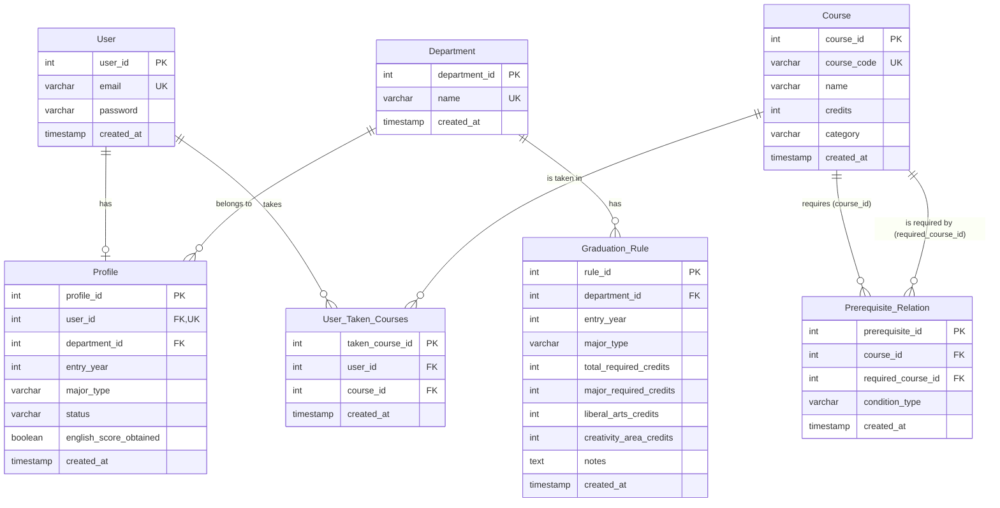

# ERD (Entity Relationship Diagram)

## 데이터베이스 구조



## 테이블 상세 설명

### 1. User (사용자)
사용자 계정 정보를 관리하는 테이블

| 컬럼명 | 타입 | 제약조건 | 설명 |
|--------|------|----------|------|
| user_id | INT | PK | 사용자 고유 ID |
| email | VARCHAR | UNIQUE | 이메일 (로그인용) |
| password | VARCHAR | NOT NULL | 비밀번호 (해시 저장) |
| created_at | TIMESTAMP | DEFAULT CURRENT_TIMESTAMP | 생성일시 |

### 2. Profile (프로필)
사용자의 학적 정보를 저장하는 테이블

| 컬럼명 | 타입 | 제약조건 | 설명 |
|--------|------|----------|------|
| profile_id | INT | PK | 프로필 고유 ID |
| user_id | INT | FK, UNIQUE | 사용자 ID (1:1 관계) |
| department_id | INT | FK | 학과 ID |
| entry_year | INT | NOT NULL | 입학년도 |
| major_type | VARCHAR | NOT NULL | 전공 유형 (단일전공, 복수전공, 부전공, 융합전공) |
| status | VARCHAR | | 학적 상태 (재학, 휴학, 졸업유예) |
| english_score_obtained | BOOLEAN | DEFAULT FALSE | 영어 점수 취득 여부 |
| created_at | TIMESTAMP | DEFAULT CURRENT_TIMESTAMP | 생성일시 |

### 3. Department (학과)
학과 정보를 관리하는 테이블

| 컬럼명 | 타입 | 제약조건 | 설명 |
|--------|------|----------|------|
| department_id | INT | PK | 학과 고유 ID |
| name | VARCHAR | UNIQUE | 학과명 |
| created_at | TIMESTAMP | DEFAULT CURRENT_TIMESTAMP | 생성일시 |

### 4. Course (과목)
과목 정보를 관리하는 테이블

| 컬럼명 | 타입 | 제약조건 | 설명 |
|--------|------|----------|------|
| course_id | INT | PK | 과목 고유 ID |
| course_code | VARCHAR | UNIQUE | 과목 코드 |
| name | VARCHAR | NOT NULL | 과목명 |
| credits | INT | NOT NULL | 학점 |
| category | VARCHAR | | 과목 분류 (전공필수, 전공선택, 교양 등) |
| created_at | TIMESTAMP | DEFAULT CURRENT_TIMESTAMP | 생성일시 |

### 5. Graduation_Rule (졸업 요건)
학과별, 입학년도별 졸업 요건을 관리하는 테이블

| 컬럼명 | 타입 | 제약조건 | 설명 |
|--------|------|----------|------|
| rule_id | INT | PK | 졸업 요건 고유 ID |
| department_id | INT | FK | 학과 ID |
| entry_year | INT | NOT NULL | 적용 입학년도 |
| major_type | VARCHAR | NOT NULL | 전공 유형 |
| total_required_credits | INT | NOT NULL | 총 이수 학점 |
| major_required_credits | INT | NOT NULL | 전공 이수 학점 |
| liberal_arts_credits | INT | NOT NULL | 교양 이수 학점 |
| creativity_area_credits | INT | | 창의 영역 학점 |
| notes | TEXT | | 추가 요건 설명 |
| created_at | TIMESTAMP | DEFAULT CURRENT_TIMESTAMP | 생성일시 |

### 6. User_Taken_Courses (수강 이력)
사용자가 수강한 과목 정보를 저장하는 테이블

| 컬럼명 | 타입 | 제약조건 | 설명 |
|--------|------|----------|------|
| taken_course_id | INT | PK | 수강 이력 고유 ID |
| user_id | INT | FK | 사용자 ID |
| course_id | INT | FK | 과목 ID |
| created_at | TIMESTAMP | DEFAULT CURRENT_TIMESTAMP | 수강 등록일시 |

### 7. Prerequisite_Relation (선수과목 관계)
과목 간 선수과목 관계를 정의하는 테이블

| 컬럼명 | 타입 | 제약조건 | 설명 |
|--------|------|----------|------|
| prerequisite_id | INT | PK | 선수과목 관계 고유 ID |
| course_id | INT | FK | 수강하려는 과목 ID |
| required_course_id | INT | FK | 선수과목 ID |
| condition_type | VARCHAR | | 조건 유형 (필수, 권장 등) |
| created_at | TIMESTAMP | DEFAULT CURRENT_TIMESTAMP | 생성일시 |

## 관계 설명

### 1:1 관계
- `User` ↔ `Profile`: 한 사용자는 하나의 프로필을 가짐

### 1:N 관계
- `User` → `User_Taken_Courses`: 한 사용자는 여러 과목을 수강
- `Department` → `Profile`: 한 학과에 여러 학생이 소속
- `Department` → `Graduation_Rule`: 한 학과는 여러 졸업 요건을 가짐 (연도별, 전공 유형별)
- `Course` → `User_Taken_Courses`: 한 과목은 여러 학생이 수강

### M:N 관계
- `Course` ↔ `Course` (Prerequisite_Relation): 과목 간 선수과목 관계

## 인덱스 권장사항

```sql
-- Profile 테이블
CREATE INDEX idx_profile_user_id ON Profile(user_id);
CREATE INDEX idx_profile_department ON Profile(department_id);
CREATE INDEX idx_profile_entry_year ON Profile(entry_year);

-- Graduation_Rule 테이블
CREATE INDEX idx_graduation_rule_dept_year ON Graduation_Rule(department_id, entry_year);

-- User_Taken_Courses 테이블
CREATE INDEX idx_taken_courses_user ON User_Taken_Courses(user_id);
CREATE INDEX idx_taken_courses_course ON User_Taken_Courses(course_id);

-- Prerequisite_Relation 테이블
CREATE INDEX idx_prerequisite_course ON Prerequisite_Relation(course_id);
CREATE INDEX idx_prerequisite_required ON Prerequisite_Relation(required_course_id);
```

## 비즈니스 규칙

1. **전공 유형별 학점 요건**
   - 단일전공: 65학점
   - 복수전공: 39학점
   - 부전공: 48학점

2. **영어 점수 요건**
   - TOEIC 700점 이상 또는 동등 수준 필수

3. **창의 영역 이수**
   - 4학점 이상 필수 (입학년도별 상이)

4. **학적 상태**
   - 재학, 휴학, 졸업유예 중 하나

5. **선수과목 관리**
   - 특정 과목 수강 전 선수과목 이수 필요
